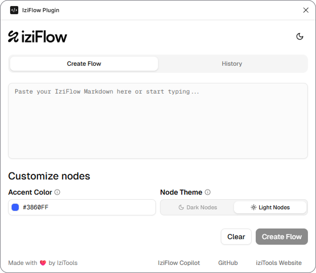

# IziFlow


Create user flows in Figma by simply describing them in natural language with IziFlow, a plugin for Figma and FigJam.

IziFlow automates the creation of user flow diagrams through an AI-powered interview process. Our specialized AI assistant conducts a guided conversation to understand your company, users, and flow requirements, then generates professional visual diagrams instantly. No syntax learning required - the AI handles everything from interview to final markdown generation.

The IziFlow workflow is completely hands-off: have a conversation with our **[IziFlow Copilot](https://chatgpt.com/g/g-680800ab82a88191afc106220253ff30-iziflow-assistant)** who interviews you about your needs, validates the proposed flow step-by-step, and generates the final code. Simply copy and paste into the plugin for instant visual creation.

## Features 
* **AI-Powered Interview Process**: Guided conversation that understands your company, users, and flow requirements without any syntax knowledge needed.
* **Step-by-Step Validation**: The AI proposes flows and validates each decision point with you before generating the final code.
* **Zero Manual Coding**: Complete automation from interview to markdown - no writing or editing required.
* **Instant Visual Creation**: Transform AI-generated code into professional flow diagrams with one click.
* **Theme Customization**: Choose between light and dark themes with customizable accent colors.
* **Rich Node Content**: Add detailed descriptions and metadata to nodes for comprehensive documentation.




Because IziFlow handles everything automatically through conversation, there's no syntax to learn or code to write. The AI assistant conducts the entire interview process and generates all the technical output. This zero-learning-curve approach means you can focus entirely on your flow logic while the system handles the implementation details.

## How It Works

### 🤖 Step 1: Interview with IziFlow Copilot
The **[IziFlow Copilot](https://chatgpt.com/g/g-680800ab82a88191afc106220253ff30-iziflow-assistant)** conducts a guided interview to understand your needs:
- **What type of flow** do you want to create?
- **What's your company's niche** and industry?
- **What's your brand's tone of voice** and style?
- **Who are your target users** and their context?

### 📝 Step 2: AI-Generated Flow Validation
The Copilot suggests a complete flow and validates each step with you:
- Proposes the flow structure and main steps
- Asks for confirmation on each decision point
- Refines based on your feedback
- Generates the final structured markdown automatically

### 🎨 Step 3: Generate in Figma
1. Copy the final markdown from the Copilot
2. Open the IziFlow plugin in FigJam
3. Paste the generated code
4. Choose your theme and accent color
5. Click "Create Flow" - your visual diagram is ready!

## How to Set Up and Run the Project

### Prerequisites

*   [Node.js](https://nodejs.org/) (which includes npm)
*   [Figma Desktop App](https://www.figma.com/downloads/)

### Setup

1.  **Clone the repository:**
    ```bash
    git clone https://github.com/luskizera/iziflow-plugin.git
    cd iziflow-plugin
    ```

2.  **Install dependencies:**
    The project uses npm for package management.
    ```bash
    npm install
    ```
3.  **Build the UI:**
    ```bash
    npm run build
    ```

4.  **Build the plugin code:**
    ```bash
    npm run buildcode
    ```

5.  **Load the plugin in Figma:**
    *   Open the Figma desktop app.
    *   Open a FigJam file.
    *   Go to **Plugins** > **Development** > **Import plugin from manifest...**
    *   Navigate to your project directory and select the `dist/manifest.json` file.