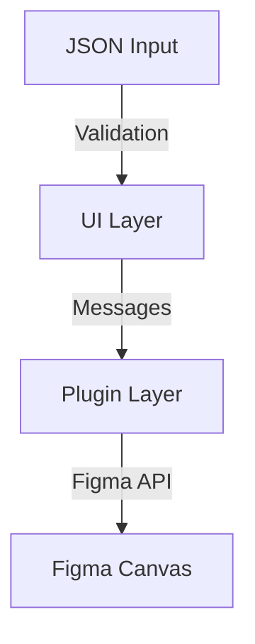

# Arquitetura do IziFlow

## Visão Geral

O IziFlow é construído usando uma arquitetura em camadas, separando a interface do usuário (UI) do código do plugin Figma. A comunicação entre essas camadas é feita através de mensagens tipadas.



## Estrutura de Camadas

### 1. UI Layer (`/src`)
- React + TypeScript
- Gerenciamento de estado com Context API
- Validação com Zod
- Estilização com TailwindCSS

### 2. Plugin Layer (`/src-code`)
- TypeScript puro
- Figma Plugin API
- Geradores de fluxo
- Utilitários de layout

## Fluxo de Dados

1. **Entrada de Dados**
```typescript
interface FlowInput {
  nodes: FlowNode[];
  connections: Connection[];
  metadata?: Record<string, any>;
}
```

2. **Validação**
```typescript
const validateFlow = (input: unknown): FlowInput => {
  return FlowSchema.parse(input);
};
```

3. **Processamento**
```typescript
interface FlowProcessor {
  validate(): boolean;
  generate(): void;
  layout(): void;
}
```

## Componentes Principais

### UI Components (`/src/components`)
- `FlowEditor` - Editor principal
- `JsonValidator` - Validação de entrada
- `FlowPreview` - Visualização em tempo real
- `ControlPanel` - Controles e configurações

### Core Components (`/src-code/lib`)
- `FlowGenerator` - Geração de fluxos
- `LayoutEngine` - Motor de layout
- `FigmaAdapter` - Adaptador para API Figma

## Sistema de Mensagens

```typescript
type MessageTypes = 
  | 'generate-flow'
  | 'update-flow'
  | 'validate-flow';

interface PluginMessage {
  type: MessageTypes;
  payload: unknown;
}
```

## Build System

### Development
```bash
src/          --> vite dev (UI)
src-code/     --> esbuild watch (Plugin)
```

### Production
```bash
src/          --> vite build
src-code/     --> esbuild
dist/         --> plugin bundle
```

## Dependências Principais

```json
{
  "ui": {
    "react": "^18.2.0",
    "reactflow": "^11.x",
    "tailwindcss": "^3.x",
    "zod": "^3.x"
  },
  "plugin": {
    "typescript": "^5.x",
    "esbuild": "^0.19.x"
  }
}
```

## Considerações de Performance

1. **Lazy Loading**
   - Componentes grandes carregados sob demanda
   - Processamento em background quando possível

2. **Otimizações**
   - Memoização de componentes React
   - Cache de layouts gerados
   - Batch updates para Figma API

3. **Limites**
   - Máximo de 100 nós por fluxo
   - Tamanho máximo de JSON: 1MB
   - Rate limiting para operações pesadas

## Segurança

1. **Validação de Entrada**
   - Schema validation rigoroso
   - Sanitização de dados
   - Verificações de tipo em runtime

2. **Sandbox**
   - Execução isolada do plugin
   - Sem acesso a APIs externas
   - Validação de origem de mensagens

## Próximos Passos

1. **Melhorias Planejadas**
   - Sistema de temas
   - Cache persistente
   - Otimização de renderização

2. **Débitos Técnicos**
   - Refatoração do motor de layout
   - Migração para Worker Threads
   - Melhorias na tipagem

3. **Roadmap Técnico**
   - Suporte a plugins externos
   - API pública documentada
   - Sistema de templates